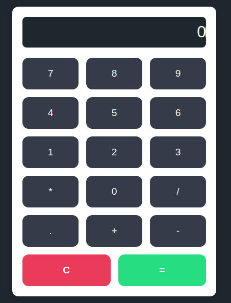

# calculator# 🧮 Calculadora Web

Una calculadora moderna y funcional construida con **HTML**, **CSS** y **JavaScript**. Soporta operaciones básicas, manejo de errores, validaciones en tiempo real, y tiene un diseño responsive atractivo.

---

## ✨ Características

- ✅ Soporte para suma, resta, multiplicación y división
- 🔢 Permite números negativos y decimales
- 🧠 Valida expresiones antes de calcular
- 🚫 Bloquea múltiples operadores consecutivos
- ⚠️ Muestra mensajes de error sin borrar el display
- 🚫 Evita múltiples puntos decimales por número
- 👀 Display siempre enfocado para entrada inmediata
- 📱 Diseño responsive y moderno con botones estilizados

---

## 🚀 Cómo usar

1. Cloná este repositorio o descargá los archivos.

2. Abrí `index.html` en tu navegador.

3. Usá el teclado o hacé clic en los botones para operar.

---

## 📁 Estructura
Calculator/
├── index.html
├── styles.css
└── script.js

---

## 🛠 Tecnologías

- HTML5
- CSS3 (Flexbox)
- JavaScript puro (sin frameworks)

---

## 💡 Ejemplos de uso

- `12 + 5` → `17`
- `-3 * 4.5` → `-13.5`
- `9 / 0` → "Snarky error message" 😈

---

## 🧼 Botones especiales

- `=`: Evalúa la expresión actual
- `C`: Limpia el display
- `.`: Agrega un punto decimal (desactivado si ya hay uno)
- Input solo acepta números y un operador

---

## 📦 Mejoras futuras (sugerencias)

- Historial de operaciones
- Soporte para teclado numérico en móviles
- Modo científico
- Dark/Light mode toggle

---

## 📸 Vista previa

 <!-- Opcional si subís una captura al repo -->

---

## 🧑‍💻 Autor

Desarrollado por Juan Manuel Roma

---

## 📝 Licencia

Este proyecto está bajo la licencia MIT. Libre para usar y modificar.

